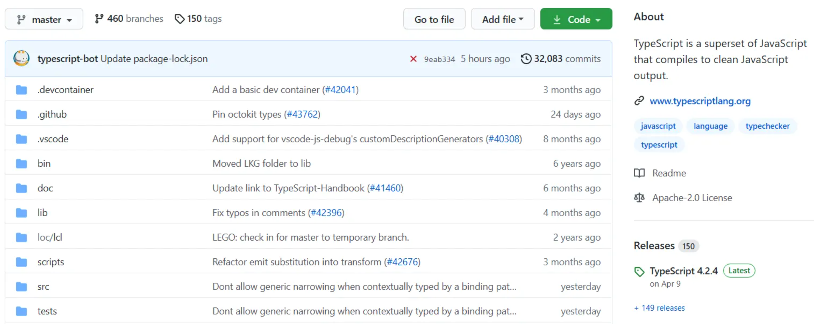

# Создание атомарных коммитов в Git

Мы все были там: Вы работали над множеством изменений одновременно, некоторые из которых не имели ничего общего. Для удобства вы решили объединить все эти изменения в один коммит и на этом закончить. Но хотя это может показаться заманчивым, на самом деле это может привести к большим проблемам в дальнейшем. Большие коммиты могут:

1. Затушевать источник ошибок или регрессий в будущем.
2. Затруднить возврат нежелательных изменений без возврата желательных.
3. Делать большие тикеты более перегруженными и сложными в управлении.

В последнее время я выработал привычку делать **атомарные коммиты**, чтобы сделать свою работу более управляемой; я рекомендую вам попробовать и посмотреть, работает ли это для вас.

## Оглавление

- Атомарные коммиты и принцип единственной ответственности
- Нет такого понятия, как слишком много коммитов
  - Сжимать или не сжимать?
- Преимущества написания атомарных коммитов в Git
  1. Атомарные коммиты облегчают отслеживание регрессий
  2. Атомарные коммиты легче возвращать (revert), сбрасывать (drop) и исправлять (amend)
  3. Атомарные коммиты облегчают выполнение больших задач
- Рекомендации по написанию чистых, атомарных коммитов
- Крошечные изменения - большие победы

## Атомарные коммиты и принцип единственной ответственности

Когда разработчики обсуждают чистый код, они часто упоминают **принцип единственной ответственности**, который гласит, что единица кода (например, функция или "компонент") должна выполнять только одну задачу. Благодаря этому код легче тестировать и использовать повторно.

Мы можем легко распространить этот принцип на Git, отдавая предпочтение атомарным коммитам, которые отвечают за документирование одной, полной единицы работы. Это не значит, что каждый коммит должен быть ограничен одним файлом или несколькими строками кода (но если это так, то пусть будет так). Скорее, это означает, что вы должны быть в состоянии описать свои изменения одним осмысленным сообщением, не пытаясь присовокупить к нему дополнительную информацию о какой-то несвязанной работе, которую вы сделали. Другой способ определить атомарный коммит - это коммит, который может быть отменён без каких-либо нежелательных побочных эффектов или регрессий, помимо тех, что вы ожидаете, основываясь на его сообщении. Если коммит удаляется из истории коммитов Git, но при этом удаляются другие легитимные изменения, значит, этот коммит не был атомарным.

Не стоит навязывать эту практику или ожидать, что она будет продуктивной для всех в вашей команде. Но в любом случае, написание атомарных коммитов - это хорошая практика, которую вы можете найти полезной в своем рабочем процессе.

## Не существует такого понятия, как слишком много коммитов

Разработчики иногда не хотят делать много маленьких коммитов, потому что беспокоятся, что это создаст ненужный шум в их истории коммитов. Но на самом деле не существует такого понятия, как "слишком много коммитов" - во многих корпоративных кодовых базах количество коммитов исчисляется десятками тысяч, а то и больше.

Чтобы дать вам представление, вот краткий обзор количества коммитов для некоторых из самых популярных репозиториев всех времен на GitHub (цифры приведены на момент написания статьи и к тому времени, когда вы будете это читать, они будут гораздо выше):

- Visual Studio Code: 82k
- tensorflow: 110k
- kubernetes: 100k
- rust: 140k
- Node.js: 33k
- TypeScript: 32k

Вы поняли суть.

Несмотря на то, что вы можете подумать, размещение большого количества коммитов не усложняет ведение Git-журнала или путешествия во времени в кодовой базе - более того, оно может _упростить_ эти задачи, изолируя изменения друг от друга и позволяя вам перемещаться в определенный момент времени, когда было сделано только _одно_ изменение. Вы можете четко различить коммиты `X`, `X-1` и `X+1`.

## Сжимать или не сжимать?

В качестве компромисса некоторые команды следуют рабочему процессу [squash-and-rebase](https://www.aleksandrhovhannisyan.com/blog/undoing-changes-in-git/#squashing), когда разработчики могут создавать любое количество коммитов в своей ветке, но перед слиянием пул-реквеста с целевой веткой эти коммиты объединяются в один с помощью процедуры `git rebase --interactive`.

Хотя это и делает вашу историю коммитов более компактной, я обнаружил, что такой рабочий процесс на самом деле вредит цели использования атомарных коммитов в первую очередь. Конечно, расширенное описание коммита в Git все еще будет содержать отдельные сообщения от всех сжатых коммитов, но эти коммиты больше похожи на артефакты - они не являются действительными ссылками в истории Git, если вы не восстановите их с помощью вашего локального [git reflog](https://www.aleksandrhovhannisyan.com/blog/undoing-changes-in-git/#6-using-git-reflog). Другие разработчики не смогут откатить или переместиться во времени к этим коммитам в истории.

Обратите внимание, что сжатие (squash) имеет смысл, если некоторые из ваших промежуточных коммитов были сделаны случайно и на самом деле должны были быть частью другого коммита. В этом случае не имеет смысла оставлять эти коммиты отдельно. Вы также можете использовать сжатие для очистки шумных или бессмысленных коммитов, например, если вы пытаетесь запустить CI-пайплайн повторно (но лучше всего исправить последний коммит и принудительно отправить его в вашу ветку, а не делать коммиты вроде "test" или "y u no work").

## Преимущества написания атомарных коммитов в Git

Атомарные коммиты решают все проблемы, о которых я говорил ранее, и дают ряд преимуществ. Вы еще больше оцените их, когда вам придется [отменять изменения в Git](https://www.aleksandrhovhannisyan.com/blog/undoing-changes-in-git/) или работать с большим количеством других разработчиков.

### 1. Атомарные коммиты облегчают отслеживание регрессий

Хотя это правда, что вам придется приложить больше усилий, чтобы разделить ваши коммиты на независимые единицы работы, эти инвестиции вполне оправдывают себя.

Во-первых, атомарные коммиты облегчают вам и вашей команде поиск источника регрессий в будущем, если вы столкнетесь с проблемой, которую особенно сложно отладить.

Если вы сделаете атомарные коммиты и запустите `git bisect`, а Git сможет определить коммит-нарушитель, вы будете более уверены, что изменения в этом коммите действительно привели к появлению ошибки и что они не затронули другие области кода. Это может значительно сузить круг файлов, которые вам теперь придется изучать более тщательно, чтобы понять, что пошло не так. Более того, возможно, вам удастся обойтись только отменой этого коммита.

Если бы вместо этого вы включили дополнительные изменения в этот коммит, вам пришлось бы выяснять, какие из этих изменений были ответственны за ошибку. Это может создать раздражающую и непредсказуемую ситуацию для разработчиков, когда ошибки могут тихо прокрасться в ваш код вместе с законными изменениями.

### 2. Атомарные коммиты легче возвращать (revert), сбрасывать (drop) и исправлять (amend)

Допустим, вы работаете над большой функцией. В ней много подвижных частей, и вам даже может понадобиться рефакторинг старого кода, чтобы приспособить его к новым изменениям. Когда вы наконец размещаете PR, некоторые рецензенты не согласны с некоторыми внесенными вами изменениями и просят отменить их. Звучит достаточно просто, верно?

К сожалению, вы не делали атомарных коммитов - для удобства вы объединили все свои изменения в один или два коммита с перекрывающимися объемами работ. Некоторые из ваших сообщений также были составлены наспех, что затрудняет определение того, в каком из этих нескольких коммитов были внесены нежелательные изменения в код.

Единственный вариант - зайти и отменить эти изменения вручную. А если изменения были особенно значительными, это будет еще более болезненно. Как оказалось, большие коммиты не так уж и удобны - вы не уделили время разделению коммитов на независимые части работы, и теперь страдаете от последствий.

Если бы вы вместо этого использовали атомарные коммиты для всей своей работы, вы смогли бы вернуть (или даже отбросить) несколько коммитов, связанных с запросами на изменения, и все было бы готово в течение нескольких минут. Pre-request review, и всё готово.

Однако это справедливо не только для запросов на изменения - пока вы работаете над тикетом, вы можете понять, что ваш текущий подход не идеален, и вам может понадобиться вернуться назад. Но если у вас в Git есть куча нефиксированных изменений - с несколькими пересекающимися проблемами и несколькими разными изменениями в одном файле, некоторые из которых нужны, а другие должны быть отброшены, - вам придется отменять свою работу вручную. Но если бы вы писали атомарные коммиты, вы могли бы отменить те, которые внесли изменения, и все (или, что еще лучше, выполнить `rebase` и полностью отказаться от этих коммитов).

### 3. Атомарные коммиты облегчают выполнение больших задач

Давайте представим, что вы находитесь в том же сценарии - работаете над большой задачей или рефакторите много файлов. Поначалу это может показаться непосильным, и ваш первый инстинкт - просто начать работать в одной области вашего приложения, чтобы посмотреть, как далеко вы сможете продвинуться. В конце концов, вы поймете, что внесли множество изменений во множество разных файлов в попытке получить работающее решение как можно быстрее. И когда приходит время осмыслить свой прогресс и зафиксировать результаты работы, это само по себе кажется сложной задачей: какое сообщение написать? Как подвести итог _всей этой работы одним коммитом_?

Если вы попытаетесь сделать несколько изменений одновременно, вы не сможете разделить их на значимые части работы, когда придет время их фиксировать. Таким образом, у вас возникнет соблазн сделать один коммит на все, лишь бы покончить с этим.

В этом сценарии отсутствие атомарных фиксаций - симптом более серьезной проблемы, которая заключается в том, что вы не разделили исходную работу на небольшие, управляемые куски; вместо этого вы пытались в спешке сделать все сразу. Если бы вы разделили работу на более мелкие задачи, то смогли бы фиксировать каждую часть работы отдельно, чтобы обеспечить чистый и точный отчет о проделанной работе.

Исходя из этого, мы видим, что атомарные фиксации имеют два преимущества:

1. Они минимизируют когнитивную нагрузку при работе над большими тикетами.
2. Они облегчают отслеживание и документирование вашего прогресса.

Написание атомарных коммитов заставляет вас вносить небольшие, управляемые изменения по мере выполнения больших задач. Это может послужить полезным напоминанием о том, на чём вы остановились в предыдущий день, если вам нужно возобновить работу или часто переключаться между контекстами. Но самое главное - это поможет облегчить психологическое бремя, связанное с необходимостью вносить сразу много изменений, мягко продвигая вас к конечной цели небольшими шагами.

## Рекомендации по написанию чистых, атомарных коммитов

Создание атомарных коммитов - это хорошая практика, но вам также захочется написать содержательные _сообщения_ о коммитах, чтобы описать свою работу. Вот несколько советов, которые могут вам пригодиться:

- Выберите время и придерживайтесь его. Я предпочитаю начинать с глагола в настоящем времени (например, `Fix X`).
- Упомяните компонент, функцию или область кода, которая была изменена.
- Упомяните ошибку, если таковая имеется, которую устраняет ваш коммит. Бонус: упомяните коммит с ошибкой.
- Если возможно, укажите в сообщении о фиксации проблему, над которой вы работаете (например, `This is a commit message (#1234)`). Это создаст ссылку на проблему #1234 на GitHub, что облегчит другим разработчикам отслеживание тикетов и PR в будущем.

Вот пример из репозитория TypeScript, как этот последний совет может выглядеть на практике:

Репозиторий TypeScript на GitHub с основным видом папок, недавними коммитами, которые их изменили, и основной информацией о репозитории. В некоторых коммитах упоминаются проблемы, на которые автоматически ставится гиперссылка.

В некоторых коммитах упоминаются проблемы, на которые автоматически ставятся гиперссылки.
Вот, собственно, и всё, что можно сказать по этому поводу. Некоторые команды придерживаются и других условностей, например, указывают префикс каждого коммита с его типом (например, `fix:`, `doc:` и т. д.). Все зависит от того, что подходит вам и вашим разработчикам.

## Крошечные изменения - большие победы

Написание атомарных коммитов в Git поначалу может показаться раздражающим - это замедляет работу и заставляет вас разбивать ее на более мелкие части. Кроме того, это требует написания содержательных, описательных сообщений о фиксации. Но хотя поначалу это может показаться неудобным, на самом деле это может улучшить качество вашей работы и облегчить жизнь вам и другим разработчикам в вашей команде.
